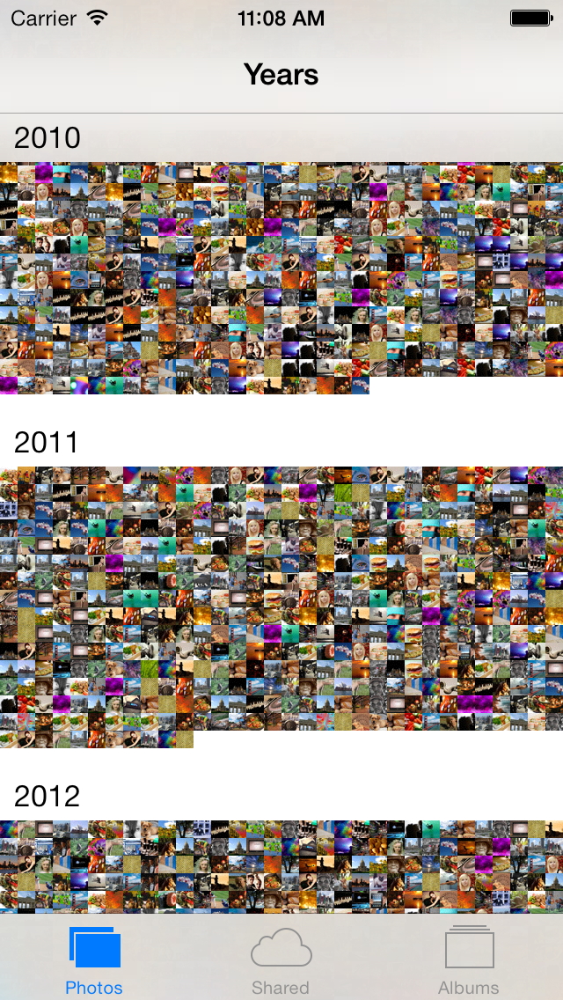

ImageFiller
===========

quickly fills your iPhones Photo Album with thousands of random images from lorempixel.com 

**Only run this on test devices and the simulator if you can wipe the device afterwards. Don't use it on a photo stream enabled device.**

Somtimes you just need a few thousand images in your iPhones photo album to test an image gallery or something. ImageFiller just fills your iOS Photo Album with random images from [http://lorempixel.com](). The dates of these images will be random dates from the last 5ish years.

The app will try to push 5000 photos to the album, about 700 will end up there. If you want more images just hit the "Load" button a few more times.

This is what your photo album will ook like afterwards:
